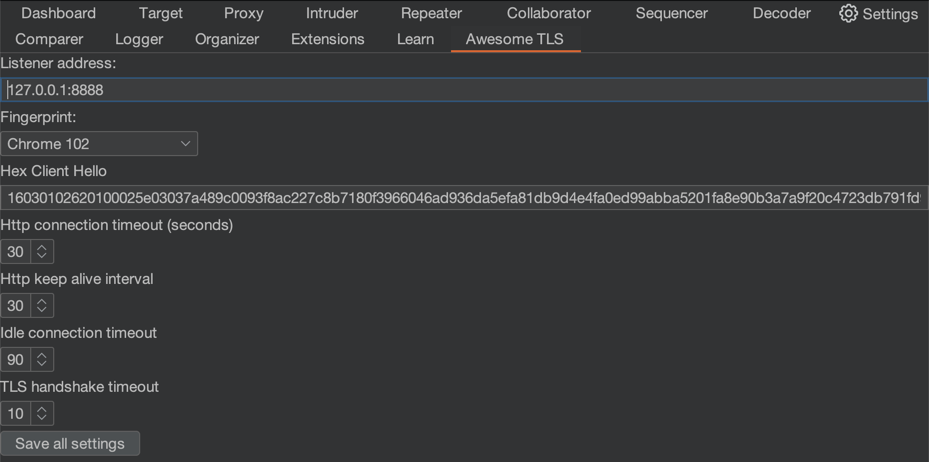

# Awesome TLS
This extension hijacks Burp's HTTP/TLS stack and allows you to spoof any [browser fingerprint](https://ja3er.com/) in order to make it more powerful and less prone to fingerprinting by all kinds of WAFs. 
It does this without resorting to hacks, reflection or forked Burp Suite Community code. All Java code in this repository only leverages Burp's Extender API.

## How it works
Unfortunately Burp's Extender API is very limited for more advanced use cases like this, so I had to play around with it to make this work. 

Once a request comes in, the extension intercepts it and forwards it to a local HTTPS server that started in the background once loaded/installed.
This server works like a proxy; it forwards the request to the destination, while persisting the original header order and applying a customizable TLS configuration.
Then, the local server forwards the response back to Burp.

Configuration settings and other necessary information like the destination server address are sent to the local server per request by a magic header.
This magic header is stripped from the request before it's forwarded to the destination server, of course.

Another option would've been to code an upstream proxy server and connect burp to it, but I personally wanted an extension because it's customizable at runtime and more portable. 

## Installation
1. Download the jar file for your operating system from [releases](https://github.com/sleeyax/burp-awesome-tls/releases). You can also download a fat jar, which works on all platforms supported by Awesome TLS. This means it's also portable and could be loaded from a USB for access from multiple different operating systems.
2. Open burp (pro or community), go to Extender > Extensions and click on 'Add'. Then, select `Java` as the extension type and browse to the jar file you just downloaded. Click 'Next' at the bottom, and it should load the extension without any errors.
3. Check your new 'Awesome TLS' tab in Burp for configuration settings and start hacking!

## Configuration
This extension should be 'plug and play' for most users, but here's an overview of all the available configuration settings that are available at the extension's dedicated tab in Burp.

**listener address**

Interface (`host:port`) the local HTTPS server should listen on. Reload the extension for the changes to take effect.

**connnection timeout**

TCP dial connection timeout.

**fingerprint**

TLS client or browser to spoof. Depending on your choice a different client hello packet will be sent during the handshake.

**fingerprint from file**

Captured TLS [client hello](https://www.rfc-editor.org/rfc/rfc8446#section-4.1.2) packet in raw bytes that should be sent during the handshake.

## Manual build Instructions
This extension was developed with JetBrains IntelliJ (and GoLand) IDE. 
The build instructions below assume you're using the same tools to build.
See [workflows](.github/workflows) for the target programming language versions.

1. Compile the go package within `./src-go/`. Run `cd ./src-go/server && go build -o ../../src/main/resources/{OS}-{ARCH}/server.{EXT} -buildmode=c-shared ./cmd/main.go`, replacing `{OS}-{ARCH}` with your OS and CPU architecture and `{EXT}` with your platform's preferred extension for dynamic C libraries. For example: `linux-x86-64/server.so`. See the [JNA docs](https://github.com/java-native-access/jna/blob/master/www/GettingStarted.md) for more info about supported platforms.
2. Compile the GUI form `SettingsTab.form` into Java code via `Build > Build project`.
3. Build the jar with Gradle: `gradle buildJar`.

You should now have one jar file (usually located at `./build/libs`) that works with Burp on your operating system.

## License
[GPL V3](./LICENSE)
